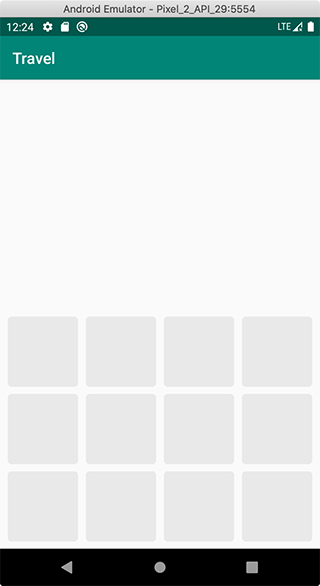

# GridDrawable

> Draw a grid background.
> Custom row, col, dividerSize, gridRadius, gridColor

# Preview


# Use
Here is a demo:
```kotlin
view.background = GridDrawable()
// or
view.background = GridDrawable(row=3, col=4, dividerSize=10, radius=5, gridColor=Color.LTGRAY)
```


